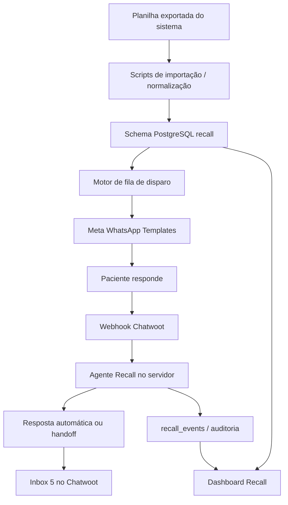

# Camila Recall 3.0 - Documentação Técnica Atual

## 1. Visão geral

Este documento consolida o estado técnico atual do projeto **Camila Recall**, frente dedicada da Camila 3.0 voltada para reativação de pacientes de clínica geral e, em casos específicos, pacientes de ortodontia adimplentes elegíveis para recall.

O objetivo principal desta frente é:

- reduzir a dependência do `n8n`
- centralizar regras de negócio, rastreabilidade e operação em uma aplicação própria
- separar completamente a operação de Recall da frente `Camila Remarketing`
- permitir evolução gradual para um agente com LLM, sem perder controle operacional

Estado deste documento:

- referência técnica consolidada do projeto até `30 de junho de 2026`

## 2. Objetivos do projeto

## 2.1 Objetivo de negócio

Construir uma operação de Recall capaz de:

- identificar pacientes elegíveis a partir de exportação manual do sistema da clínica
- priorizar quem deve ser contatado
- disparar templates aprovados da Meta com segurança
- receber respostas no Chatwoot
- conduzir o atendimento inicial por agente
- transferir o paciente para atendimento humano no momento correto

## 2.2 Objetivo técnico

Substituir uma arquitetura excessivamente dependente de automações em `n8n` por uma base mais previsível e auditável, composta por:

- servidor próprio
- banco estruturado por schema dedicado
- painel operacional
- motor de fila e disparo
- webhook de atendimento
- trilha de eventos

## 2.3 Princípio de execução

O projeto foi conduzido com lógica de **MVP em ondas**, priorizando o mínimo operacional validável antes de avançar para camadas mais sofisticadas.

## 3. Escopo funcional do Recall

O Recall trabalha com pacientes já conhecidos da clínica, não com leads frios.

O enquadramento da comunicação é:

- acompanhamento preventivo
- retomada de cuidado
- oferta de avaliação clínica + limpeza dental em condição especial

A Camila Recall:

- abre a conversa
- esclarece dúvidas
- lida com objeções simples
- conduz o paciente até o aceite
- transfere para o humano

A Camila Recall **não**:

- agenda horários
- consulta agenda
- promete dia ou disponibilidade
- conclui o agendamento

## 4. Regras de elegibilidade da base

## 4.1 Fonte de dados

A clínica não possui API aberta no sistema da recepção. Por isso, a entrada da operação é feita por planilha exportada manualmente.

Planilha-base validada no MVP:

- `Orthodontic - Sistema (35).xlsx`

## 4.2 Público-alvo principal

Entram no Recall:

1. Pacientes de clínica geral:
   - identificados pela coluna `L = Den. Responsável`
   - dentistas elegíveis:
     - `Giuliano Ferreira Queiroz`
     - `Gustavo Moraes Prado`
     - `Tainá Ribeiro De Moraes`
     - `Ana Clara Rezeck De Moura`
     - `Gustavo Cesar Dias Bevilaqua`
     - `Não informado`

2. Pacientes de ortodontia adimplentes, como exceção operacional:
   - responsável fora da lista de clínica geral
   - `M = Sit.Financ.` igual a `ADIMPLENTE`
   - mais de 6 meses sem atendimento
   - sem agendamento atual

## 4.3 Regras de entrada no MVP

O paciente entra no Recall quando:

1. pertence a grupo elegível
2. está há mais de 6 meses sem atendimento
3. não possui agendamento atual
4. possui telefone válido após normalização

## 5. Arquitetura da solução

## 5.1 Estrutura geral

A solução atual foi organizada como pacote isolado em:

- [camila_recall](C:/Users/dsalb/OneDrive/Documentos/Camila%203_0/camila_recall)

Essa pasta possui ciclo próprio de publicação, deploy e operação.

## 5.2 Componentes principais

### Aplicação backend

Arquivo principal:

- [recall_server.js](C:/Users/dsalb/OneDrive/Documentos/Camila%203_0/camila_recall/recall_server.js)

Responsabilidades:

- servir o dashboard
- expor APIs operacionais
- integrar com banco PostgreSQL/Supabase
- gerar e processar fila de disparo
- integrar com Meta WhatsApp
- receber webhook do Chatwoot
- executar lógica do agente de atendimento
- registrar eventos auditáveis

### Dashboard

Arquivo principal:

- [public/recall_dashboard.html](C:/Users/dsalb/OneDrive/Documentos/Camila%203_0/camila_recall/public/recall_dashboard.html)

Responsabilidades:

- apresentar KPIs operacionais
- exibir a fila do motor de Recall
- permitir geração de fila
- permitir execução controlada de lote
- oferecer leitura operacional do estado atual

### Banco de dados

Banco:

- PostgreSQL via Supabase

Schema dedicado:

- `recall`

Objetivo do schema dedicado:

- isolar dados da frente Recall
- evitar cruzamento com `Camila Remarketing`
- simplificar rastreamento e manutenção

### Integração Meta WhatsApp

Finalidade:

- disparo dos templates aprovados
- uso de número dedicado da frente Recall

### Integração Chatwoot

Finalidade:

- recebimento das respostas dos pacientes
- atendimento humano na inbox dedicada
- aplicação de labels
- handoff operacional

## 5.3 Fluxo macro da arquitetura

## 6. Stack técnica

## 6.1 Linguagem e runtime

- `Node.js`

## 6.2 Dependências do projeto

Conforme [package.json](C:/Users/dsalb/OneDrive/Documentos/Camila%203_0/camila_recall/package.json):

- `dotenv`
- `pg`
- `xlsx`

## 6.3 Frontend

- HTML estático
- Tailwind via CDN
- JavaScript embutido na página

## 6.4 Infraestrutura

- GitHub
- GitHub Actions para publicação de imagem
- GHCR para imagem Docker
- Portainer para deploy
- Traefik para roteamento
- Supabase como banco
- Chatwoot como camada de atendimento
- Meta WhatsApp Cloud API para disparo

## 7. Estrutura de pastas do projeto

Dentro de [camila_recall](C:/Users/dsalb/OneDrive/Documentos/Camila%203_0/camila_recall):

- `recall_server.js`
  - backend principal
- `public/`
  - dashboard da operação
- `scripts/`
  - importação, seed e utilitários
- `migrations/`
  - evolução do schema `recall`
- `docs/`
  - documentação funcional e técnica
- `outputs/`
  - saídas intermediárias do MVP

## 8. Banco de dados e modelo lógico

## 8.1 Migrations atuais

Arquivos existentes:

- [17_create_recall_tables.sql](C:/Users/dsalb/OneDrive/Documentos/Camila%203_0/camila_recall/migrations/17_create_recall_tables.sql)
- [18_move_recall_to_schema.sql](C:/Users/dsalb/OneDrive/Documentos/Camila%203_0/camila_recall/migrations/18_move_recall_to_schema.sql)
- [19_recall_followup_fields.sql](C:/Users/dsalb/OneDrive/Documentos/Camila%203_0/camila_recall/migrations/19_recall_followup_fields.sql)
- [20_recall_dispatch_queue.sql](C:/Users/dsalb/OneDrive/Documentos/Camila%203_0/camila_recall/migrations/20_recall_dispatch_queue.sql)

## 8.2 Tabelas principais

### `recall.recall_leads`

Tabela principal de pacientes elegíveis/importados.

Responsabilidades:

- armazenar identidade do paciente
- telefone normalizado
- origem do segmento
- status operacional
- flags como resposta, opt-out, meta_error
- vínculo com conversa do Chatwoot
- dados de follow-up e handoff

Campos funcionais relevantes observados no código:

- `paciente_nome`
- `telefone`
- `ultimo_atendimento`
- `dentista_responsavel`
- `origem_segmento`
- `situacao_financeira`
- `status`
- `respondeu`
- `opt_out`
- `handoff_at`
- `handoff_resolved`
- `chatwoot_conversation_id`
- `chatwoot_contact_id`
- `proxima_acao_tipo`
- `proxima_acao_em`
- `ultima_tentativa_em`
- `ultima_tentativa_resultado`
- `tentativa_count`
- `meta_error`

### `recall.recall_events`

Tabela de auditoria e trilha operacional.

Responsabilidades:

- registrar eventos de disparo
- registrar respostas recebidas
- registrar respostas do agente
- registrar erros do agente
- registrar follow-ups
- permitir leitura histórica do lead

Tipos de evento já presentes ou observados na lógica:

- `dispatch_executado`
- `chatwoot_inbound`
- `chatwoot_agent_reply`
- `chatwoot_agent_error`
- `tentativa_contato`
- `followup_agendado`
- `seed_teste`
- `reset_teste_manual`

### `recall.recall_dispatch_queue_items`

Fila operacional de disparo.

Responsabilidades:

- reservar itens para envio
- impedir reprocessamento indevido
- guardar snapshot do contexto do disparo
- suportar execução manual e controlada

Status observados:

- `pendente`
- `reservado`
- `cancelado`
- `processado`

## 9. APIs e rotas principais

## 9.1 Painel

- `GET /recall`

Entrega:

- dashboard principal da operação

## 9.2 Configuração operacional

- `GET /api/recall/dispatch/config`

Entrega:

- modo de envio
- configuração Meta
- configuração Chatwoot
- labels
- templates
- timezone
- configuração da camada LLM

## 9.3 Webhook Chatwoot

- `POST /api/recall/chatwoot/webhook`

Responsabilidade:

- receber mensagens da inbox `5`
- localizar o lead correspondente
- classificar a mensagem
- responder automaticamente quando aplicável
- abrir handoff quando houver aceite
- registrar eventos

## 9.4 Geração de fila

- `POST /api/recall/dispatch/generate`

Responsabilidade:

- selecionar leads prontos para contato
- gerar itens na fila auditável

## 9.5 Execução de lote

- `POST /api/recall/dispatch/execute-batch`

Responsabilidade:

- processar lote de fila
- enviar template Meta ou simular envio
- registrar `dispatch_executado`

## 9.6 Outras APIs operacionais observadas

A aplicação possui ainda endpoints auxiliares para:

- consulta de leads
- consulta de eventos
- leitura de filas
- atualização operacional de lead
- agendamento de follow-up

## 10. Motor de disparo

## 10.1 Objetivo

Executar disparos controlados, seguros e auditáveis.

## 10.2 Controles implementados

- modo `dry_run`
- modo `real_send`
- allowlist de telefones
- allowlist de lead IDs
- janela de horário configurável
- limite máximo por execução
- uso de número dedicado da Recall
- bloqueio de disparo quando credenciais Meta exclusivas não estão presentes

## 10.3 Templates em uso

Atualmente a frente trabalha com templates aprovados como âncoras:

- `recall_abertura_1`
- `recall_lembrete_2`

O disparo foi validado em produção para o número de teste controlado.

## 10.4 Regras de proteção

O sistema evita disparos quando:

- o lead já respondeu
- há handoff humano em aberto
- o lead está em opt-out
- o lead já recebeu estágio equivalente
- o item de fila não está em status executável
- o horário está fora da janela permitida

## 11. Dashboard operacional

## 11.1 Objetivo

Ser o **Centro Operacional** da frente Recall, separado do Remarketing.

## 11.2 Informações exibidas

Conforme implementação atual, o painel apresenta:

- total de leads
- leads mapeados
- clínica geral
- ortodontia adimplente
- pendentes
- prontos para contato
- handoffs abertos
- respostas do dia
- retornos do dia
- opt-outs
- telefones inválidos
- lotes
- leitura operacional da fila

## 11.3 Função do painel no MVP

No estágio atual, o painel já cumpre quatro papéis:

1. visão de status da base
2. leitura operacional do dia
3. geração de fila
4. execução controlada de lote

## 12. Integração com Chatwoot

## 12.1 Inbox dedicada

Inbox da Recall:

- `5`

Essa inbox já foi validada como canal correto de resposta da operação.

## 12.2 Labels operacionais

Labels utilizadas:

- `recall_agendar`
- `aguardando_atendimento`
- `ia_off`
- `recall_opt_out`
- `recall_numero_errado`
- `recall_sem_interesse`

## 12.3 Comportamento implementado

Quando o paciente responde:

- a conversa entra pelo webhook do Chatwoot
- o servidor identifica o lead
- a Camila responde ou encerra conforme a intenção
- quando há aceite, o sistema:
  - responde ao paciente
  - insere nota privada
  - aplica labels
  - abre handoff
  - desliga a IA naquela conversa

## 12.4 Handoff humano

O handoff já está operacional.

Comportamento atual:

- paciente aceita
- a Camila envia mensagem de transferência
- a conversa recebe `recall_agendar`
- a conversa recebe `aguardando_atendimento`
- a conversa recebe `ia_off`
- o time humano assume a partir dali

## 13. Agente de atendimento

## 13.1 Estado atual

Atualmente o agente em produção é **determinístico**.

Isso significa que:

- a decisão de fluxo é controlada por regras explícitas no servidor
- ainda não depende de LLM para operar o básico

## 13.2 Capacidades já implementadas

O agente atual já trata:

- `Quero informações`
- `Não reconheço`
- objeções simples de prevenção
- `Sim, quero`
- `Já agendei`
- `Não tenho interesse`
- `Parem de me enviar`
- `Número errado`

## 13.3 Ajustes operacionais já implementados

- delay artificial entre recebimento e resposta
- melhoria do tom das mensagens
- aplicação de `aguardando_atendimento` no handoff
- suporte a nota interna mais útil para o humano
- captura de preferência espontânea em mensagens como:
  - `sábado`
  - `durante a semana`
  - `manhã`
  - `tarde`
  - `noite`

## 13.4 Limites atuais da Camila

Mesmo no futuro com LLM, continuam sendo limites duros:

- não agenda
- não oferta horários
- não consulta agenda
- não promete disponibilidade

## 14. Camada LLM híbrida

## 14.1 Estado atual

Já existe base de código para uma evolução híbrida com LLM, mas o modo segue desligado por padrão:

- `RECALL_LLM_ENABLED=false`

## 14.2 Modelo default atual no projeto

Modelo definido como padrão:

- `gpt-4.1-mini`

Motivo da escolha:

- melhor equilíbrio entre custo e obediência a instrução para esse caso
- mais adequado ao Recall do que um modelo frontier caro
- suficiente para classificação, redação e resumo de handoff

## 14.3 Estratégia arquitetural da camada LLM

O desenho implementado é híbrido:

- regras duras continuam no servidor
- o LLM interpreta a mensagem
- o LLM propõe intenção e resposta
- o sistema executa efeitos externos
- em caso de erro, o sistema volta automaticamente ao fluxo determinístico

## 14.4 Prompt do agente

Referência:

- [recall_agent_prompt_v1.md](C:/Users/dsalb/OneDrive/Documentos/Camila%203_0/camila_recall/docs/recall_agent_prompt_v1.md)

O prompt operacional já orienta o modelo a:

- falar com pacientes já conhecidos
- usar tom humano e curto
- não soar agressiva
- não inventar valores
- devolver JSON estruturado
- ser conservadora em mensagens ambíguas

## 15. Scripts e utilitários

Scripts existentes em [scripts](C:/Users/dsalb/OneDrive/Documentos/Camila%203_0/camila_recall/scripts):

- `recall_generate_mvp_import.js`
  - gera base MVP a partir da planilha
- `recall_import_wave2.js`
  - importa leads para o banco
- `recall_move_to_schema.js`
  - suporte à organização do schema
- `recall_run_wave2_migration.js`
  - executa migration da onda 2
- `recall_run_wave3_followup_migration.js`
  - executa migration da onda 3
- `recall_run_wave4_dispatch_queue_migration.js`
  - executa migration da onda 4
- `inspect_recall_schema.js`
  - inspeção do schema
- `seed_recall_test_lead.js`
  - cria lead controlado para teste

## 16. Publicação e deploy

## 16.1 Repositório próprio

A frente Recall foi preparada para ter publicação própria, separada do restante da Camila 3.0.

## 16.2 Pipeline atual

- código versionado em repositório próprio
- GitHub Actions publica imagem Docker
- Portainer consome a imagem e faz o deploy
- domínio dedicado:
  - `https://dashboard.oc332.com.br`

## 16.3 Estado validado em ambiente publicado

Já foram validados:

- painel no domínio dedicado
- disparo real pelo número dedicado da Recall
- resposta chegando na inbox `5`
- webhook funcionando
- agente respondendo
- handoff funcionando

## 17. Configurações principais

## 17.1 Banco

- `PGHOST`
- `PGPORT`
- `PGDATABASE`
- `PGUSER`
- `PGPASSWORD`
- `RECALL_DB_SCHEMA=recall`

## 17.2 Motor de envio

- `RECALL_DRY_RUN`
- `RECALL_ENABLE_REAL_SEND`
- `RECALL_TEST_DESTINATION_PHONE`
- `RECALL_ALLOWED_PHONES`
- `RECALL_ALLOWED_LEAD_IDS`
- `RECALL_MAX_SENDS_PER_RUN`
- `RECALL_TIMEZONE`
- `RECALL_TIME_WINDOWS`

## 17.3 Templates

- `RECALL_TEMPLATE_OPENING`
- `RECALL_TEMPLATE_REMINDER`
- `RECALL_TEMPLATE_LANGUAGE`
- `RECALL_TEMPLATE_USE_FIRST_NAME`
- `RECALL_REMINDER_DELAY_DAYS`

## 17.4 Chatwoot

- `CHATWOOT_BASE_URL`
- `CHATWOOT_ACCOUNT_ID`
- `CHATWOOT_API_ACCESS_TOKEN`
- `CHATWOOT_RECALL_INBOX_ID`

## 17.5 Meta

- `RECALL_META_WHATSAPP_TOKEN`
- `RECALL_META_PHONE_NUMBER_ID`

## 17.6 Agente

- `RECALL_AGENT_ENABLED`
- `RECALL_AGENT_SENDER`
- `RECALL_AGENT_DELAY_MIN_MS`
- `RECALL_AGENT_DELAY_MAX_MS`

## 17.7 LLM

- `RECALL_LLM_ENABLED`
- `RECALL_LLM_PROVIDER`
- `RECALL_LLM_MODEL`
- `RECALL_LLM_TEMPERATURE`
- `RECALL_LLM_MAX_OUTPUT_TOKENS`
- `OPENAI_API_KEY`
- `OPENAI_BASE_URL`

## 18. O que já está implementado

Resumo do que hoje já existe e já foi validado:

### Base e ingestão

- leitura de planilha
- regra de elegibilidade consolidada
- normalização de telefones
- geração de base operacional
- importação para banco

### Persistência

- schema `recall`
- leads
- eventos
- fila de disparo
- follow-up fields

### Operação

- dashboard separado
- KPIs principais
- geração de fila
- execução de lote
- trilha auditável

### Disparo

- integração com Meta
- número dedicado da Recall
- dry run
- real send
- bloqueios de segurança

### Atendimento

- inbox 5 no Chatwoot
- webhook funcionando
- agente determinístico ativo
- handoff humano operacional
- labels operacionais

### Evolução de IA

- base de modo LLM híbrido
- prompt do agente documentado
- fallback determinístico em caso de falha

## 19. O que falta implementar para finalizar o projeto

Embora o MVP operacional já exista, o projeto ainda não pode ser considerado totalmente finalizado. Os principais blocos pendentes são:

## 19.1 Ativação controlada da camada LLM

Pendências:

- ligar o `RECALL_LLM_ENABLED=true` em ambiente de teste
- configurar `OPENAI_API_KEY`
- validar qualidade real das classificações
- validar robustez do parse JSON
- revisar custo por conversa

## 19.2 Ambiente de teste do agente sem Chatwoot

Recomendado implementar:

- endpoint interno para simulação de mensagens
- teste rápido de prompt, intenção e resposta
- eventual shadow mode, com o LLM opinando sem responder ao paciente

## 19.3 Régua completa de follow-up

Hoje o motor já suporta base de disparo e campos de follow-up, mas ainda falta fechar a operação completa da régua:

- terceiro toque
- cooldown
- regras de reentrada
- encerramento automático como `sem_resposta`
- agenda operacional da régua completa

## 19.4 Consolidação da operação com base real

Pendências:

- carregar a base completa validada de pacientes elegíveis
- executar piloto além do número de teste
- ampliar de forma gradual a allowlist
- medir resposta, handoff e opt-out

## 19.5 Revisão de UX operacional do dashboard

O painel já funciona, mas ainda pode ser finalizado com:

- filtros mais claros
- simulação do agente
- leitura mais rica da fila
- visualização mais detalhada de eventos por lead
- leitura dedicada de handoffs abertos

## 19.6 Ferramentas humanas de operação

Itens desejáveis:

- macros operacionais no Chatwoot
- respostas prontas do time humano
- critérios padronizados para resolver handoff
- fluxo padronizado para `já agendado`, `sem interesse`, `telefone inválido`

## 19.7 Observabilidade e governança

Ainda vale consolidar:

- métricas de acerto do agente
- métricas por intenção
- revisão de mensagens sensíveis
- rotinas de auditoria
- políticas de versionamento do prompt

## 20. Riscos e pontos de atenção

## 20.1 Dependência de exportação manual

Sem API do sistema da recepção, a operação depende de disciplina na extração e atualização da planilha.

## 20.2 Qualidade de dados

Riscos:

- telefone inválido
- duplicidade
- agendamento desatualizado
- responsável incorreto

## 20.3 Qualidade do agente

Mesmo com LLM, será necessário manter:

- regras duras
- fallback
- supervisão humana
- revisões de copy

## 20.4 Compliance operacional do canal

O Recall depende de uso prudente do WhatsApp:

- baixo volume inicial
- janela controlada
- poucos toques
- respeito imediato a opt-out

## 21. Próximos passos recomendados

Ordem sugerida para fechamento do projeto:

1. criar endpoint de simulação do agente LLM
2. ativar modo LLM em ambiente controlado
3. validar intenções e custo em testes internos
4. ajustar prompt e guardrails
5. subir piloto com base real em allowlist limitada
6. medir respostas, handoffs, opt-outs e problemas de base
7. finalizar a régua completa de follow-up
8. consolidar o dashboard como centro operacional completo

## 22. Conclusão

O projeto **Camila Recall** já possui um MVP funcional, publicado e validado ponta a ponta, com:

- base de dados isolada
- painel próprio
- motor de disparo
- integração Meta
- integração Chatwoot
- handoff humano
- agente inicial operacional

O projeto ainda não está 100% finalizado porque a camada LLM, a régua completa de follow-up e alguns reforços de observabilidade e operação ainda precisam ser concluídos.

Mesmo assim, a arquitetura atual já representa um avanço importante em relação ao modelo anterior baseado em acúmulo de workflows no `n8n`, porque centraliza:

- regras
- rastreabilidade
- operação
- manutenção
- evolução futura

## 23. Arquivos de referência

- [README.md](C:/Users/dsalb/OneDrive/Documentos/Camila%203_0/camila_recall/README.md)
- [recall_server.js](C:/Users/dsalb/OneDrive/Documentos/Camila%203_0/camila_recall/recall_server.js)
- [public/recall_dashboard.html](C:/Users/dsalb/OneDrive/Documentos/Camila%203_0/camila_recall/public/recall_dashboard.html)
- [recall_agent_prompt_v1.md](C:/Users/dsalb/OneDrive/Documentos/Camila%203_0/camila_recall/docs/recall_agent_prompt_v1.md)
- [recall_mvp_wave1.md](C:/Users/dsalb/OneDrive/Documentos/Camila%203_0/camila_recall/docs/recall_mvp_wave1.md)
- [recall_regua_templates.md](C:/Users/dsalb/OneDrive/Documentos/Camila%203_0/camila_recall/docs/recall_regua_templates.md)
- [recall_templates_copy_v1.md](C:/Users/dsalb/OneDrive/Documentos/Camila%203_0/camila_recall/docs/recall_templates_copy_v1.md)
